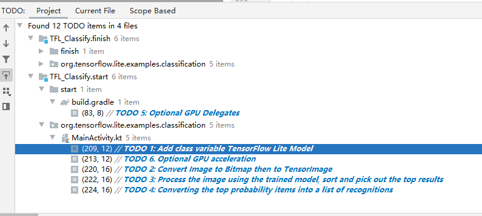

## 下载并运行初始代码

在https://github.com/hoitab/TFLClassify.git下载代码的ZIP包并解压缩到工作目录

打开Android Studio,点击File->open,找到项目文件


### 真机调试

1. 进入开发者模式：以小米手机为例，选择设置->我的设备->全部参数，快速连续点击MIUI版本

2. 开启USB调试：选择设置->开发者选项。打开USB调试和USB安装

3. 手机通过USB接口连接开发平台

4. 可以看到AS可以连接到小米手机

   

5. 可以看到以下界面：

   

   

## 向应用中添加TensorFlow Lite

1. 右键”start"模块，点击New>Other>TensorFlow Lite Model

   ![image-20220511135217495]E3/image-20220511135217495.png)

2. 选择已经下载的自定义的训练模型。点击“Finish”完成模型导入

   

3. 最终TensorFlow Lite模型被成功导入，并生成摘要信息

   

   

   

   ## 检查代码中的TODO项

   1. 点击View->Tool Windows->TODO通过TODO列表视图，找到项目的未完成之处

   

   2. 默认情况下了列出项目所有的TODO项，进一步按照模块分组（Group By）

      

   ## 添加代码重新运行APP

   

  1. 定位“start”模块**MainActivity.kt**文件的TODO 1，在ImageAnalyzer下面添加初始化训练模型的代码

   

   ```kotlin
    // TODO 1: Add class variable TensorFlow Lite Model
     private val flowerModel = FlowerModel.newInstance(ctx)
   ```

    

 2.  在CameraX的analyze方法内部，需要将摄像头的输入`ImageProxy`转化为`Bitmap`对象，并进一步转化为`TensorImage` 对象

```kotlin
 val tfImage = TensorImage.fromBitmap(toBitmap(imageProxy))
```

3. 在analyze方法内部，对图像进行处理并生成结果，主要包含下述操作：

- 按照属性`score`对识别结果按照概率从高到低排序
- 列出最高k种可能的结果，k的结果由常量`MAX_RESULT_DISPLAY`定义

```kotlin
 val outputs = flowerModel.process(tfImage)
      .probabilityAsCategoryList.apply {
          sortByDescending { it.score } // Sort with highest confidence first
      }.take(MAX_RESULT_DISPLAY) // take the top results
```

4. 将识别的结果加入数据对象`Recognition` 中，包含`label`和`score`两个元素。后续将用于`RecyclerView`的数据显示

```kotlin
for (output in outputs) {
      items.add(Recognition(output.label, output.score))
  }
```

5. 将原先用于虚拟显示识别结果的代码注释掉或者删除

   ```
               // START - Placeholder code at the start of the codelab. Comment this block of code out.
   //            for (i in 0 until MAX_RESULT_DISPLAY){
   //                items.add(Recognition("Fake label $i", Random.nextFloat()))
   //            }
   ```

   

